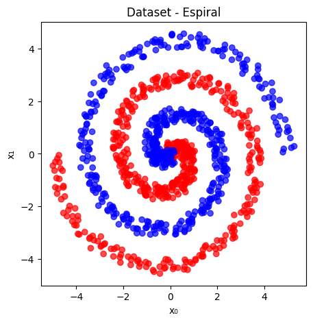

# Binary Classification with Neural Networks in PyTorch

[](https://www.python.org/)

[](https://opensource.org/licenses/MIT)

This repository contains an educational implementation of a **Multi-Layer Perceptron (MLP)** neural network developed in **PyTorch**. The project was inspired by the *TensorFlow Playground*, allowing for training visualization and experimentation with different architectures and data geometries.


## 🚀 Features

* **"From Scratch" Implementation**: Manual optimization of weights and biases via Stochastic Gradient Descent (SGD).
* **Data Geometries**: Support for four types of synthetic distributions:
* **Spiral**: Intertwined data (highly non-linear).
* **Gauss**: Gaussian clusters (linearly separable).
* **Circle**: Concentric data.
* **XOR**: Exclusive OR logical distribution.


* **Dynamic Architecture**: Hidden layers configuration through simple lists (e.g., `[32, 32, 16]`).
* **Visualization**: Automatic generation of Loss evolution graphs (train vs. test) for convergence and overfitting analysis.


## 🛠️ Tech Stack

* **Python 3**
* **PyTorch**: Tensor manipulation and automatic gradients.
* **Matplotlib**: Data plotting and visualization.
* **Numpy**: Array and tensor handling.


## 📋 Prerequisites

To run this notebook locally, install the required dependencies:

```bash
pip install torch matplotlib numpy
```


## ⚙️ Hyperparameters Configuration

The model's behavior can be adjusted directly in the constants block of the code:

* `N`: Total number of samples.
* `NOISE`: Data noise level (recommended between 5.0 and 10.0 for the Spiral dataset).
* `BATCH_SIZE`: Number of samples per weight update (Mini-batch SGD).
* `LEARNING_RATE`: Optimizer step size.
* `ACTIVATION`: Activation function (`"relu"`, `"tanh"`, or `"sigmoid"`).
* `EPOCHS`: Number of training iterations.
* `HIDDEN_LAYERS`: List defining the depth and width of the network.


## 📊 Visual Results

To demonstrate the network's capability to learn complex non-linear decision boundaries, here is an experiment run on the **Spiral Dataset**.

### 1. Data Distribution
The dataset consists of two intertwined classes (Red and Blue), representing a challenging geometry that requires a deep architecture to classify correctly.

<p align="center">
  
  <br>
  <em>Figure 1: Visualization of the Spiral Dataset generated with high noise.</em>
</p>


### 2. Training Performance
The graph below illustrates the **Binary Cross-Entropy Loss** evolution over 5,000 epochs.

* **Blue Line:** Training Loss
* **Orange Line:** Test Loss

Note the sharp convergence around epoch 2,000. The close alignment between the training and test curves indicates that the model successfully generalized the spiral pattern without significant overfitting.

<p align="center">
  
  <br>
  <em>Figure 2: Training vs. Test Loss evolution.</em>
</p>


## 🏗️ Code Structure

1. **Data Generation**: Custom classes that generate Cartesian coordinates and class labels.
2. **Data Splitting**: A robust `train_test_split` function that partitions the dataset dynamically.
3. **`Model` Class**:
* **Smart Initialization**: Uses *He initialization* for ReLU and *Xavier initialization* for other functions.
* **Inference**: Forward pass implementation maintaining numerical stability.
* **Update**: Binary Cross-Entropy calculation and manual gradient updates.
4. **Training Loop**: Manages epochs and monitors test set performance in real-time using `torch.no_grad()`.


## 📈 How to Use

1. Clone the repository or open the file in Google Colab.
2. Choose the desired dataset by changing the index in `DATASET = lista_datasets[i]`.
3. Define the architecture in `HIDDEN_LAYERS`.
4. Run all cells.
5. Observe the console to monitor loss and the final graph to validate the model's generalization.


---

## ⚠️ Language Note

Please note that the code comments are currently in **Portuguese**, as this project was originally developed for a university assignment.

## 📄 Author

Developed by **Vitor Hugo Rodovalho**.

---

**License**: MIT License
